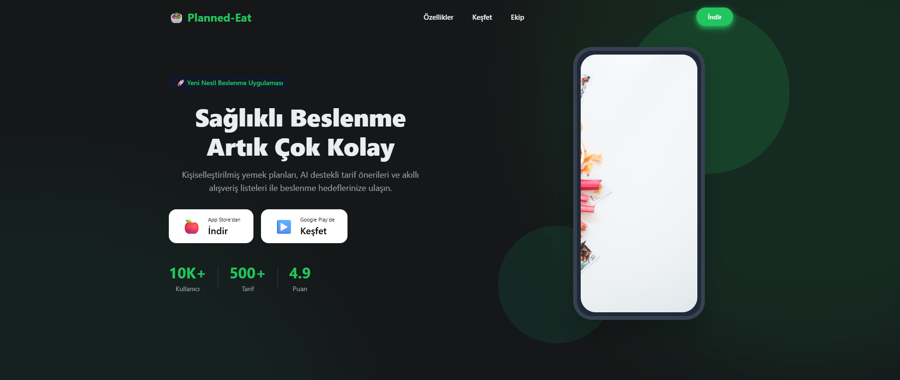

# 🥗 Planned-Eat Web

Modern, responsive, and animated landing page for the **Planned-Eat** mobile application. developed as a university graduation project.

This project serves as the official web presence for Planned-Eat, an AI-powered meal planning and nutrition assistant.



## 🚀 About The Project

**Planned-Eat Web** is a high-performance single-page application (SPA) built to showcase the innovative features of the Planned-Eat ecosystem. 

Designed with **React Native Web**, it delivers a seamless, native-like experience across all devices—from desktop browsers to mobile screens. The landing page features a cutting-edge **Glassmorphism design**, dynamic **scroll animations** powered by Reanimated, and a vibrant **Green-themed** aesthetic that reflects the app's focus on health and vitality.

### ✨ Key Features

- **Dynamic Morphing Header**: A unique header that transforms from a transparent bar to a floating, interactive pill with bubble details upon scrolling.
- **Glassmorphism & Glow Effects**: Modern UI trends including background blurs, deep charcoal themes, and vibrant accent glows (Priot.io inspired).
- **Interactive Cards**: Feature and Team cards with smooth, physics-based hover animations.
- **Responsive Layout**: A "Write Once, Run Everywhere" codebase that adapts perfectly to any screen size.
- **Scroll Reveal**: Sections animate elegantly into view using a custom Intersection Observer implementation.
- **Dynamic Content**: Fully data-driven content manageability via `constants/data.ts`.

## 🛠️ Technologies

- **Core**: [React Native](https://reactnative.dev/), [React Native Web](https://necolas.github.io/react-native-web/)
- **Framework**: [Expo](https://expo.dev/), [Expo Router](https://docs.expo.dev/router/introduction/)
- **Animation**: [React Native Reanimated](https://docs.swmansion.com/react-native-reanimated/)
- **Styling**: StyleSheet API (CSS-in-JS)
- **Language**: TypeScript

## 📂 Project Structure

```
Planned-Eat-Web/
├── app/                    # Page and Route structures
│   ├── index.tsx           # Main Landing Page
│   └── _layout.tsx         # Root Layout
├── components/
│   └── landing/            # Landing page components
│       ├── HeroSection.tsx
│       ├── FeaturesSection.tsx
│       ├── MediaGallerySection.tsx
│       ├── TeamSection.tsx
│       ├── Header.tsx      # Sticky Glassmorphism Header
│       └── ...
├── constants/
│   ├── data.ts             # All text, image, and link data
│   └── theme.ts            # Color palette and theme settings
└── ...
```

## 🏁 Installation and Setup

Follow these steps to run the project locally:

1.  **Clone the repository:**
    ```bash
    git clone https://github.com/username/planned-eat-web.git
    cd planned-eat-web
    ```

2.  **Install dependencies:**
    ```bash
    npm install
    ```

3.  **Start the web server:**
    ```bash
    npm run web
    ```
    Open `http://localhost:8081` in your browser.

## 📝 Content Editing

You don't need to change the code to update texts, images, or team members on the site. Simply edit the `constants/data.ts` file.

```typescript
// Example: constants/data.ts
export const heroContent = {
  title: "Change Title Here",
  // ...
};
```

## 👥 Development Team

This project was developed by the following team as part of a graduation thesis:

- **Yusuf Ad** - Full Stack Developer
- **Yunus Mert Kok** - Mobile Developer
- **Osman Ileri** - UI/UX Designer

## 📄 License

This project is licensed under the MIT License.
